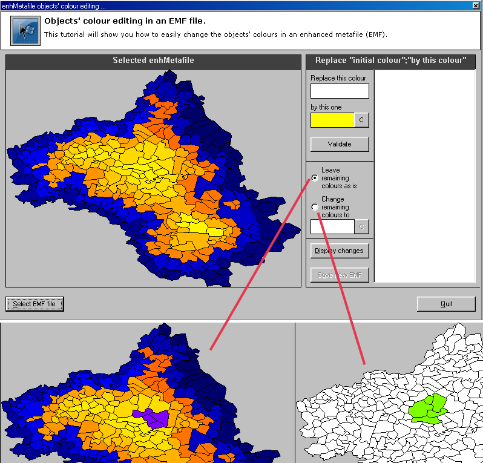



## enhMetafile objects' colour editing

### Description

I guess most of you won't see any interest in this submission. But I had to face this problem on a project and found nothing corresponding to my needs. I found a few OCX that could have answered my needs but I don't wanna pay more than 1000$ just for 1 function. This one lets you open an enhanced metafile (EMF only, didn't write it for wmf) and pick the objects' colours. Then select a replacement colour and display the results. You'll be able to save the result as an EMF file. Use i.e. Adobe Illustrator to see that all your objects are still effective, only the colours changed.

This could also be a start for modifying the objects positions, forms,... on the fly. This code is definitly simple,and answers to my needs.

A description on how to use it can be found in the form comments. Luckily it helps you :-)
 
### More Info
 

             |
---                |---
**Submitted On**   |2005-05-09 08:56:52
**By**             |[brainwasher](https://github.com/Planet-Source-Code/PSCIndex/blob/master/ByAuthor/brainwasher.md)
**Level**          |Intermediate
**User Rating**    |4.8 (19 globes from 4 users)
**Compatibility**  |VB 6\.0
**Category**       |[Miscellaneous](https://github.com/Planet-Source-Code/PSCIndex/blob/master/ByCategory/miscellaneous__1-1.md)
**World**          |[Visual Basic](https://github.com/Planet-Source-Code/PSCIndex/blob/master/ByWorld/visual-basic.md)
**Archive File**   |[enhMetafil1886605102005\.zip](https://github.com/Planet-Source-Code/brainwasher-enhmetafile-objects-colour-editing__1-60456/archive/master.zip)

